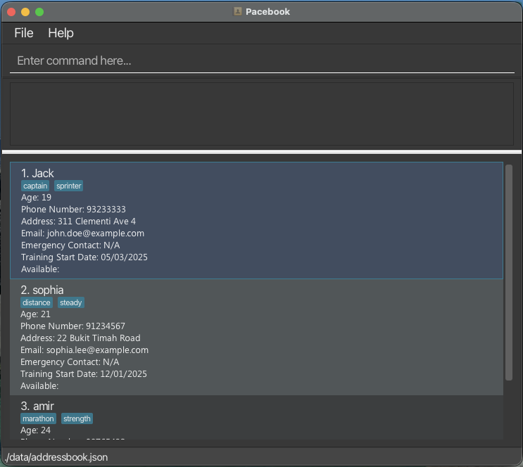

# Pacebook

---

## 🏃 About

Pacebook helps running coaches better organise athlete information and monitor performance over time. By turning athlete records into performance trends, the platform supports informed coaching decisions, improves training effectiveness, and reduces administrative workload, allowing coaches to focus on athlete growth.

---

## 📖 Features
Pacebook helps running coaches:
- Add, view and delete athlete profiles and training records

---

## 🏢 Acknowledgement
This project is based on the AddressBook-Level3 project created by the [SE-EDU initiative](https://se-education.org).
